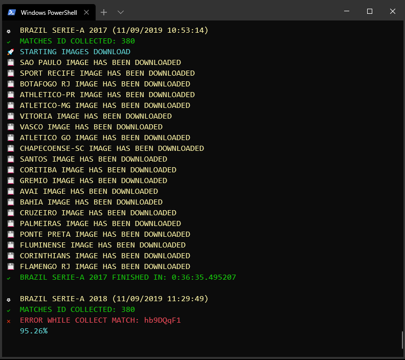

<h1 align="center">
  
</h1>

<p align="center">
  <a href="#-technologies">Technologies</a>&nbsp;&nbsp;&nbsp;|&nbsp;&nbsp;&nbsp;
  <a href="#-scraping">Scraping</a>&nbsp;&nbsp;&nbsp;|&nbsp;&nbsp;&nbsp;
  <a href="#-statistics">Statistics</a>&nbsp;&nbsp;&nbsp;|&nbsp;&nbsp;&nbsp;
  <a href="#-documentation">Documentation</a>
</p>

<br>

<p align="center">
  
</p>

## 🛠️ Technologies

- [Selenium](https://selenium-python.readthedocs.io/)
- [TinyDB](https://tinydb.readthedocs.io/en/latest/)

## ▶️ How to use 

To run my example you have to download [chromedriver](https://chromedriver.chromium.org/) compatible with your [chrome version](https://www.whatismybrowser.com/).

You can use others driver following the [Selenium docs](https://selenium-python.readthedocs.io/).

For the example, we use FlashscoreScraping as a lib.

To start, we created a directory named *flashscore-scraping-example*.
```bash
mkdir flashscore-scraping-example
cd ./flashscore-scraping-example
```
Within this directory, we have to clone this repository.
```bash
git clone https://github.com/gustavofariaa/FlashscoreScraping.git
```
After clone this repository, we have to install the dependencies.
```bash
cd ./FlashscoreScraping
pip install -r requirements.txt
cd ..
```

## 🤖 Scraping

To Scraping data we have to create a main.py at the root of the directory.
```python
from FlashscoreScraping import Scraping
from selenium import webdriver

# Scraping startup
scraping = Scraping()

# Selenium startup
driver = webdriver.Chrome('chromedriver')

# get all matches of Brazilian Championship Serie A 2019
scraping.collect(driver, 'brazil', 'serie-a', 2019)

# get all LaLiga matches from 2012 until 2019
scraping.collect(driver, 'spain', 'laliga', 2018, 2012)

driver.quit()
```

> It is important that you have to download [chromedriver](https://chromedriver.chromium.org/) compatible with your [chrome version](https://www.whatismybrowser.com/) and that it is in the root directory.

Finally we run the FlashscoreScraping run the command.
```bash
python main.py
```

## ⚽ Statistics

To get specific statistics of a team, you can import Statistics as a lib in main.py, just like we did before with Scraping.

```python
from FlashscoreScraping import Statistics

# Statistics startup
statistics = Statistics()

# get all matches where the Atletico MG win in 2018
statistics.get_win_matches('brazil', 'serie-a', 'Atletico-MG', 2018)

# get all matches where the Atletico MG lost between 2014 and 2016
statistics.get_lose_matches('brazil', 'serie-a', 'Atletico-MG', 2016, 2014)

# get all matches where the Atletico MG draw in 2015
statistics.get_draw_matches('brazil', 'serie-a', 'Atletico-MG', 2015)

# get all possession ball of Bayern Munich in 2019
statistics.get_statistic_by_team('germany', 'bundesliga', 'Bayern Munich', statistic, 2017)

# get all the names of teams that participated in the Premier League in 2019
statistics.get_teams('england', 'premier-league', 2013)
```

## 📚 Documentation

### Parameters

- **path**: by default, the path is initialized with './data', but the path can be changed to your preferred path.

- **driver**: Selenium driver

- **country**: country name where the championship is held

- **championship**: championship name

- **team**: team name

- **statistic**: one this statistics
    ```python
        ============================== STATISTICS ===============================
        "ball_possession",  "goal_attempts", "shots_on_goal", "shots_off_goal", 
        "blocked_shots",    "free_kicks",    "corner_kicks",  "offsides", 
        "total_passes",     "fouls",         "yellow_cards",  "goalkeeper_saves", 
        "completed_passes", "tackles",       "attacks",       "dangerous_attacks" 
        =========================================================================
    ```
    
- **last_year**: championship year

- **first_year**: required only if you need matches within a given time interval

### Scraping

- instantiate object *Scraping*
    ```python
    Scraping(path)
    ```
- start collect flashscore data
    ```python
    scraping.collect(driver, country, championship, last_year, first_year)
    ```

### Statistics

- instantiate object *Statistics*
    ```python
    Statistics(path)
    ```

- get all the names of the teams that participated in a championship
    ```python
    statistics.get_teams(country, championship, last_year, first_year)
    ```
    
- get all matches where the specified team win in a championship
    ```python
    statistics.get_win_matches(country, championship, team, last_year, first_year)
    ```

- get all matches where the specified team lose in a championship
    ```python
    statistics.get_lose_matches(country, championship, team, last_year, first_year)
    ```

- get all matches where the specified team draw in a championship
    ```python
    statistics.get_draw_matches(country, championship, team, last_year, first_year)
    ```

- get specified statistic from one team in a championship
    ```python
    statistics.get_statistic_by_team(country, championship, team, statistic, last_year, first_year)
    ```

<br>

---

<br>

<p align="center">
  <a href="https://twitter.com/gufariaa" target="_blank">
    
  </a>
    <a href="https://www.linkedin.com/in/gustavofariaa/" target="_blank">
    
  </a>
</p> 